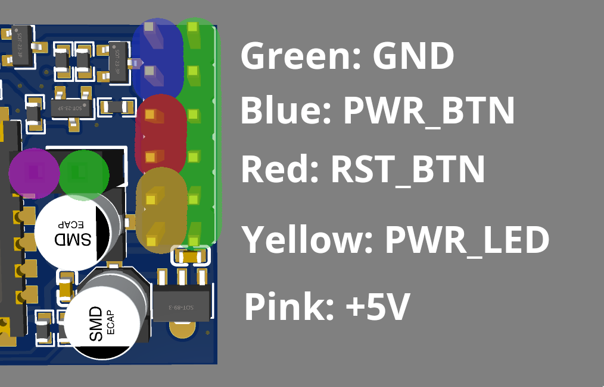
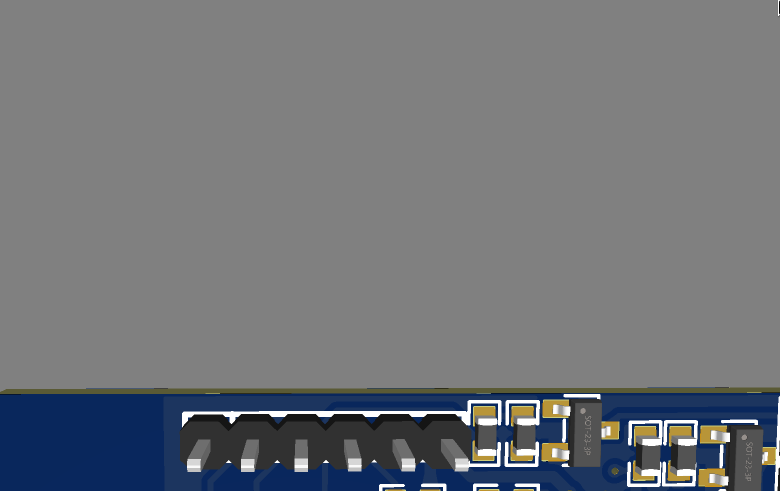
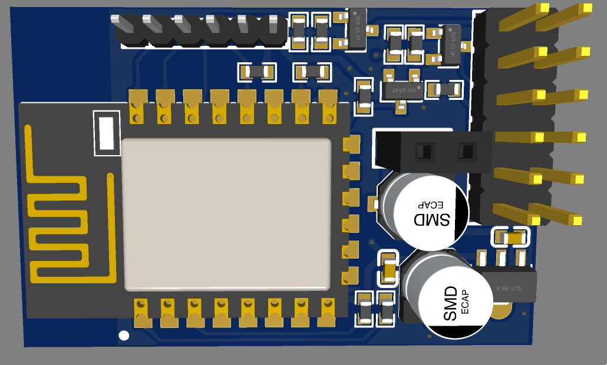
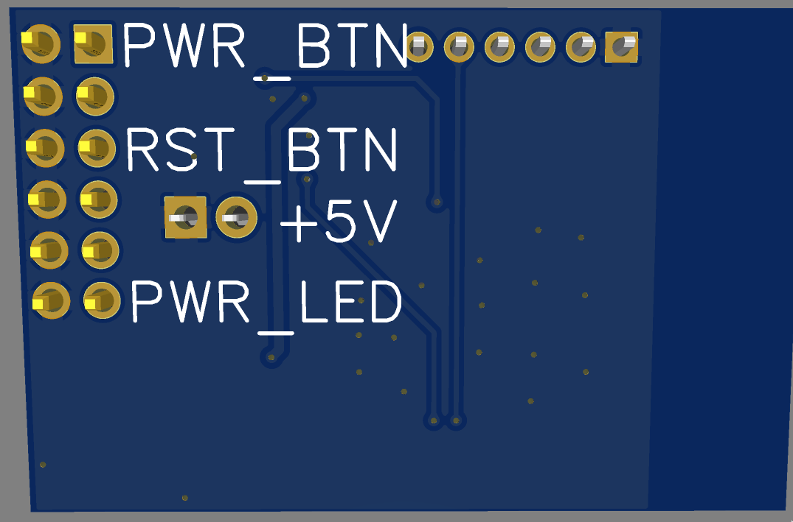
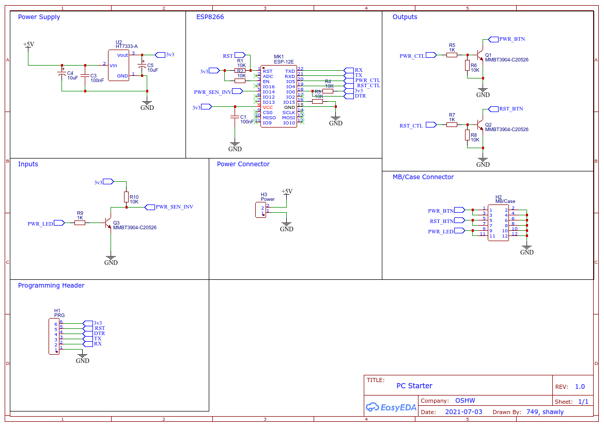

# PC-Starter
This is a small board to start a pc that has lost power or has no wake-on-lan.

## Pinout

### PC Connections

#### Main Connector 6x2

 **watch the polarity!**

The entire right side of the main connector is commoned to `GND`

Top Left to Bottom Left:

1. `PWR_BTN` Plug in your cases power button
2. `PWR_BTN` Plug in power button cable to motherboard
3. `RST_BTN` Plug in your cases reset button
4. `RST_BTN` Plug in reset button cable to motherboard
5. `PWR_LED` plug in your cases power led
6. `PWR_LED` plug in power led cable to motherboard

#### Power Connector 2x1

1. `GND`
2. `5V` Find a 5V line that is always on (usually on the motherboard of the PC)

### Programming 6x1

Left to Right:

1. `GND`
2. `RX`
3. `TX`
4. `DTR`
5. `RST`
6. `3.3V`

## Board

### Front

### Back

###

## Schematic

